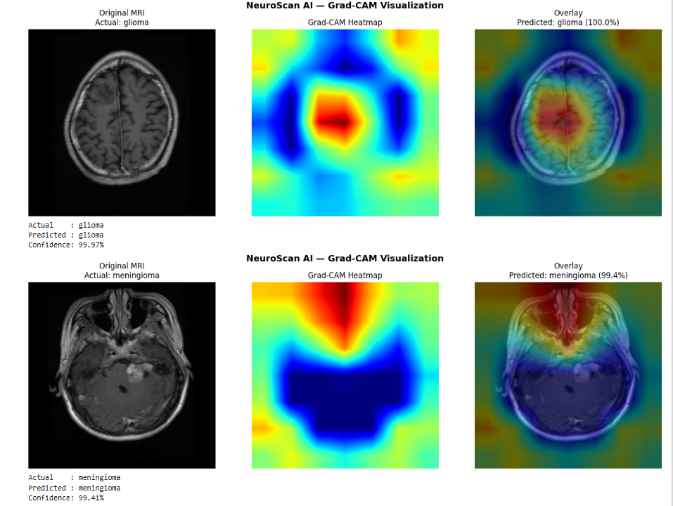
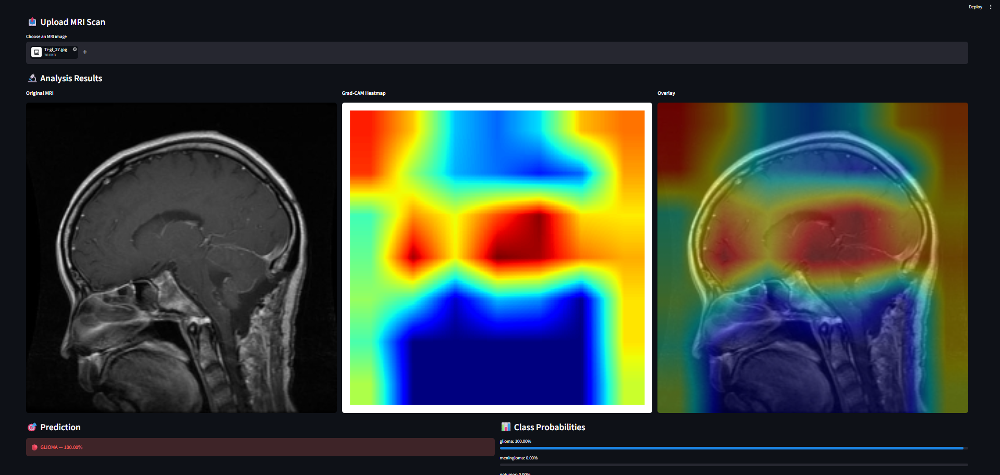

# 🧠 NeuroScan AI — Brain Tumor Detection & Classification


A deep learning powered brain tumor detection and classification system built using **EfficientNetB0 Transfer Learning** achieving **93.06% accuracy** on 4 tumor classes with **Grad-CAM explainability** for medical interpretability.

---

## 🎯 Project Overview

Brain tumor detection is one of the most critical challenges in medical imaging. This project builds an end-to-end AI pipeline that:

- Classifies brain MRI scans into 4 categories
- Achieves **93.06% accuracy** using Transfer Learning
- Provides **visual explainability** using Grad-CAM heatmaps
- Deploys as an interactive **Streamlit web application**

---

## 🏥 Problem Statement

In countries like India and rural regions worldwide, there is a severe shortage of radiologists. Patients often wait months for MRI scan analysis. This AI system can **pre-screen MRI scans instantly** and flag critical cases — helping doctors prioritize urgent attention and potentially saving lives.

---

## 📊 Dataset

- **Source:** [Brain Tumor MRI Dataset — Kaggle](https://www.kaggle.com/datasets/masoudnickparvar/brain-tumor-mri-dataset)
- **Total Images:** 7,200
- **Training:** 5,600 images (1,400 per class)
- **Testing:** 1,600 images (400 per class)
- **Classes:** Glioma, Meningioma, No Tumor, Pituitary

---

## 🧠 Model Architecture

### Phase 1 — CNN from Scratch
Built a custom 3-block CNN architecture:

```
Conv2D(32) → BatchNorm → MaxPool → Dropout
Conv2D(64) → BatchNorm → MaxPool → Dropout
Conv2D(128) → BatchNorm → MaxPool → Dropout
Flatten → Dense(256) → Dropout → Dense(4)
```

**Result: 64.94% accuracy**

### Phase 2 — Transfer Learning (ResNet50)
Applied ResNet50 pretrained on ImageNet with custom classification head.

**Result: 77.38% accuracy**

### Phase 3 — Transfer Learning (EfficientNetB0) ⭐
Applied EfficientNetB0 with correct domain-specific preprocessing:

```
EfficientNetB0 (frozen) → GlobalAveragePooling2D
→ BatchNorm → Dense(256) → Dropout(0.4) → Dense(4)
```

**Result: 93.06% accuracy** 🏆

---

## 📈 Results

| Model | Accuracy |
|-------|----------|
| CNN from Scratch | 64.94% |
| ResNet50 Transfer Learning | 77.38% |
| EfficientNetB0 Transfer Learning | **93.06%** 🏆 |

### Classification Report:

| Class | Precision | Recall | F1-Score |
|-------|-----------|--------|----------|
| Glioma | 0.93 | 0.81 | 0.86 |
| Meningioma | 0.90 | 0.91 | 0.90 |
| No Tumor | 0.92 | 1.00 | 0.96 |
| Pituitary | 0.97 | 1.00 | 0.98 |
| **Overall** | **0.93** | **0.93** | **0.93** |

---

## 🌡️ Grad-CAM Explainability

Implemented Gradient-weighted Class Activation Mapping (Grad-CAM) to visualize which regions of the MRI scan influenced the model's prediction — making the AI interpretable for medical professionals.



---

## 🖥️ Streamlit App

An interactive web application where doctors can:
- Upload any MRI scan
- Get instant tumor classification
- See confidence percentage
- View Grad-CAM heatmap highlighting the detected region



---

## 🔑 Key Insights

- **Preprocessing matters:** Wrong preprocessing → 27% accuracy. Correct EfficientNet preprocessing → 84% in epoch 1!
- **Transfer Learning power:** EfficientNetB0 started at 84% in epoch 1 vs CNN scratch starting at 54%
- **Medical AI responsibility:** Implemented custom threshold tuning for Glioma (lowered to 0.25) to improve recall from 78% to 81% — because missing a tumor is more dangerous than a false alarm
- **Explainability:** Grad-CAM showed model correctly focusing on anatomically accurate regions — pituitary at brain base, meningioma at surface, glioma in brain tissue

---

## 🛠️ Tech Stack

| Tool | Purpose |
|------|---------|
| Python 3.11 | Core language |
| TensorFlow/Keras | Deep Learning |
| EfficientNetB0 | Transfer Learning |
| OpenCV | Image Processing |
| Grad-CAM | Explainability |
| Streamlit | Web App Deployment |
| Matplotlib/Seaborn | Visualization |
| Scikit-learn | Evaluation Metrics |

---

## 📁 Project Structure

```
NeuroScan-AI/
│
├── NeuroScan_AI_Brain_Tumor_Detection.ipynb  ← Main notebook
├── app.py                                     ← Streamlit app
├── best_efficient_local.keras                 ← Trained model
├── requirements.txt                           ← Dependencies
├── screenshots/                               ← App screenshots
│   ├── gradcam.png
│   └── app.png
└── README.md
```

---

## 🚀 How to Run

**1. Clone the repository:**
```bash
git clone https://github.com/yourusername/NeuroScan-AI.git
cd NeuroScan-AI
```

**2. Install dependencies:**
```bash
pip install -r requirements.txt
```

**3. Run Streamlit app:**
```bash
streamlit run app.py
```

---

## 📦 Requirements

```
tensorflow==2.21.0
streamlit
opencv-python
numpy
pandas
matplotlib
seaborn
scikit-learn
Pillow
```

---

## 🔮 Future Scope

- Partner with hospitals to fine tune on real clinical MRI data — expected to push accuracy above 97%
- Implement 3D MRI analysis using volumetric data
- Support DICOM format — actual hospital grade medical image format
- Deploy on cloud (AWS/GCP) for real world accessibility
- Build mobile app for use in rural clinics

---

## ⚠️ Disclaimer

This tool is for **research and educational purposes only**. It should not be used as a substitute for professional medical diagnosis. Always consult a qualified medical professional for diagnosis and treatment.

---

## 👤 Author

**Asmit Yadav**
- Domain: Deep Learning & Medical AI

---

⭐ **If you found this project helpful, please give it a star!**
